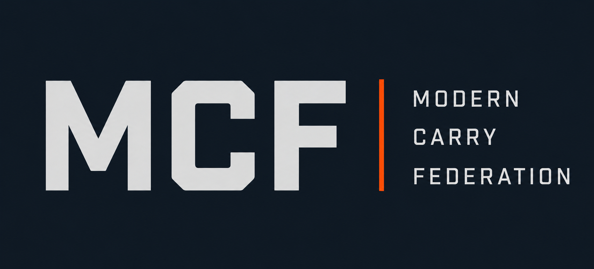

# Modern Carry Federation

> A modern concealed-carry action pistol sport built around practical skills,
> safety, accessibility, and continuous improvement.

MCF is designed to test useful shooting skills with normal carry equipment.
The rules favor clear safety standards, equitable competition, and stages that
reward speed and accuracy without unnecessary theatrics.

## Rulebook

| Chapter | Topic |
| ---: | --- |
| 1 | [Purpose and Identity](rulebook/01-purpose.md) |
| 2 | [Core Tenets](rulebook/02-tenets.md) |
| 3 | [Safety](rulebook/03-safety.md) |
| 4 | [Range Commands](rulebook/04-commands.md) |
| 5 | [Stage Design](rulebook/05-stages.md) |
| 6 | [Divisions](rulebook/06-divisions.md) |
| 7 | [Equipment](rulebook/07-equipment.md) |
| 8 | [Scoring](rulebook/08-scoring.md) |
| 9 | [Disqualifications](rulebook/09-dq.md) |
| 10 | [Match Administration](rulebook/10-admin.md) |
| Appendix | [Glossary and Examples](rulebook/appendix.md) |
